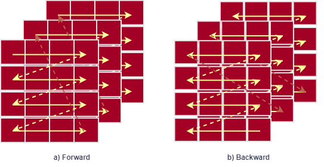

# Xmamba

**Now we have open-sourced the pre-processing, training, inference, and metrics computation codes.**

XMamba: Glioma Segmentation on Post-treatment

Programming Intergration - Artificial Intelligence, supervised by Mr. Nguyễn Đức Dũng, semester 241




## Contact 
If you have any questions about our project, please feel free to contact us by email at loc.tran04@hcmut.edu.vn.

## Environment install
Clone this repository and navigate to the root directory of the project.

```bash
git clone https://github.com/trlocne/Xmamba.git

cd XMamba
```
### Install Requirements

```bash
pip install requirements.txt
```

## Simple test

```bash
python 1_inference.py
```
## Preprocessing, training, testing, inference, and metrics computation


### Data downloading 

Data is from [https://www.kaggle.com/datasets/trlocne204/brats5](https://www.kaggle.com/datasets/trlocne204/brats5)

### Preprocessing
In my setting, the data directory of BraTS2023 is : "/kaggle/input/brats2024-small-dataset/BraTS2024_small_dataset/"
```bash
python 2_preprocessing.py
```

### Training
```bash
python 3_train.py
```

### Inference
```bash
python 4_predict.py
```
## Acknowledgement
Many thanks for these repos for their great contribution!

[https://github.com/MIC-DKFZ/nnUNet](https://github.com/MIC-DKFZ/nnUNet)

[https://github.com/ge-xing/SegMamba](https://github.com/ge-xing/SegMamba)

[https://github.com/Project-MONAI/MONAI](https://github.com/Project-MONAI/MONAI)

[https://github.com/hustvl/Vim](https://github.com/hustvl/Vim)

[https://github.com/bowang-lab/U-Mamba](https://github.com/bowang-lab/U-Mamba)
